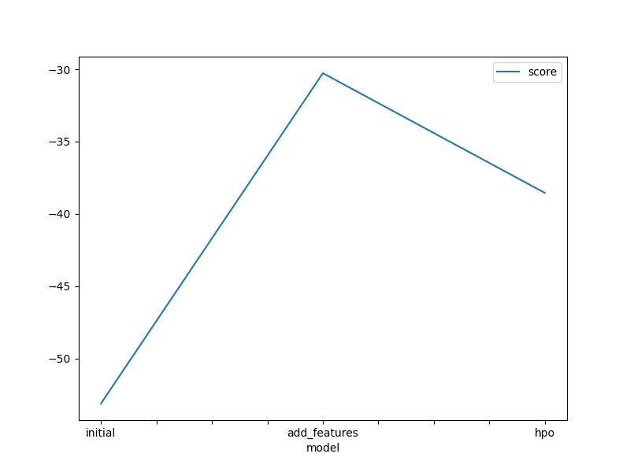
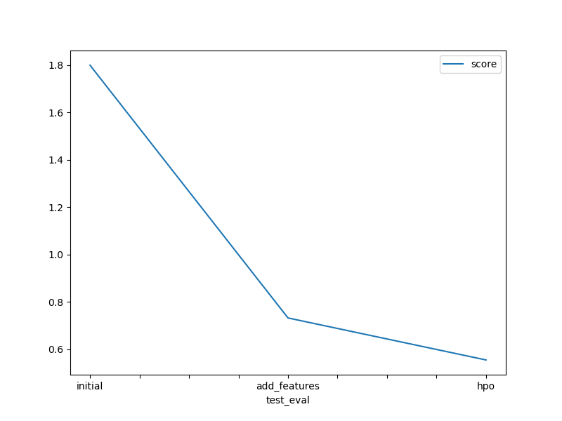

# Report: Predict Bike Sharing Demand with AutoGluon Solution
Nirmal Chandrasingh

## Initial Training
### What did you realize when you tried to submit your predictions? What changes were needed to the output of the predictor to submit your results?
The main realization was how the predictions could not have negative values, since they denote the count variable. Hence I floored them by 0 to make sure that is the lowest value to provide meanngful predictions

### What was the top ranked model that performed?
When it comes to rank based on RMSE surprisingly the model with extra features (but no parameter tuning) was the best with a RMSE of 30.22. It was surprising to see it get a lower kaggle score than the parameter tuned model which had a RMSE of 38.55

## Exploratory data analysis and feature creation
### What did the exploratory analysis find and how did you add additional features?
The EDA helped identify some features such as season and weather that were treated as continous variables but instead they were categorical in nature. Also I noticed that a lot of features had something to do with time and hour of the day so used the datetime feature to extract hour of the day and month to account for seasonality in demand

### How much better did your model preform after adding additional features and why do you think that is?
The models RMSE decreased from 53.16 to 30.22 (by 43%) just by adding hour and month features and convering season and weather into categories. The main reason for this would be seasonal patterns in demand that are captured by temporal features such as 'hour' and 'month'. Also season and weather now being treated as categorical helps fit the right pattern by treating each categories as equally likely (instead of continuous) 

## Hyper parameter tuning
### How much better did your model preform after trying different hyper parameters?
The model's performance (RMSE) actually went down a bit with RMSE increasing from 30.22 to 38.55. One explanation can be that the model picked without tuning was 'WeightedEnsemble_L3'. I used 2 tree based models such as GBM and Xgboost for tuning which might not have been better candidates than 'WeightedEnsemble_L3'.  

### If you were given more time with this dataset, where do you think you would spend more time?
Find the parameters specific to 'WeightedEnsemble_L3' and understand the intuition behind those to create a grid to train on those parameters.

### Create a table with the models you ran, the hyperparameters modified, and the kaggle score.
|model|hpo1|hpo2|hpo3|score|
|--|--|--|--|--|
|initial|time_limit=600|presets = 'best_quality'|None|1.80139|
|add_features|time_limit=600|presets = 'best_quality'|None|0.72901|
|hpo|time_limit=600|presets = 'best_quality'|gbm_options = {'num_boost_round': 100,'num_leaves': space.Int(lower=26, upper=66, default=36)},xgb_options = {'n_estimators': 100,'learning_rate': space.Real(0.01, 0.3, default=0.1),'max_depth': space.Int(3, 10, default=6)}|0.55446|

### Create a line plot showing the top model score for the three (or more) training runs during the project.

TODO: Replace the image below with your own.

### Create a line plot showing the top kaggle score for the three (or more) prediction submissions during the project.

TODO: Replace the image below with your own.

## Summary
TODO: Add your explanation
